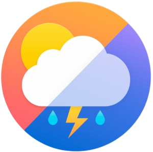
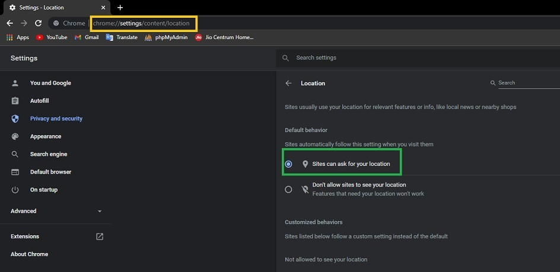
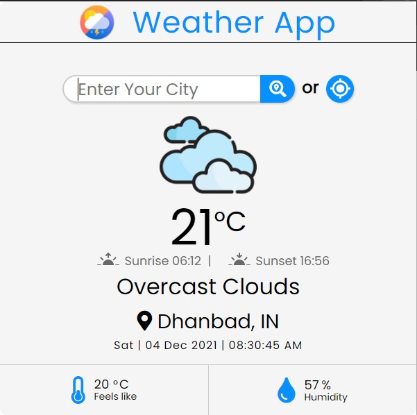

# Weather APP (Google Chrome Extension)
It is a google chrome extension that displays the current weather condition (temperature, humidity, real feal, sunrise time, etc.) of the location you are in or the location you search for.
<br/><br/>



<br/><br>

# Deployment
- Download the project and extract the project to any of your prefered locations.
- Locate to the chrome extension manager or search following in the chrome search bar.
```
chrome://extensions
```


- Turn on the Developer Mode and Click on **Load Unpacked**.
- Locate to the project folder that contains the manifest.json file and click on the select folder.
- All Done.

## To use the extension


- Go to the extension panel and click on **Weather App** Extension.

<br/><br/>

# 🛠 Skills Used
### Javascript, HTML, CSS
<br/><br/>

# API used
https://openweathermap.org/api
<br/><br/>
# Permission
Your browser needs to allow the use of <strong>geolocation</strong>. This is done by going to the ***chrome://settings/content/location*** and clicking on the **Sites can ask for your location**.

* **Note:** This is not permission for the extension to use your location. It is only for the browser to allow the use of your location.

* **Your privacy is important. Your location will not be saved.**

<h3> <b> This step is optional. It is only needed if you want to use the location button in the extension.</b></h3>
<br/>





<br/><br/>

<h3> <b> It will store last search location as cookie on <i>your computer</i> to access the same location weather when you open the extension again. </b></h3>
<br/><br/>

# Screenshot



<br/><br/>

# Author 
<b>DEEPAK AGARWAL</b>
 <br/><br/>

<br/><br/>
[](https://github.com/deepaksanwaria/)
[](https://www.linkedin.com/in/deepak-agarwal-2460831a9/)
